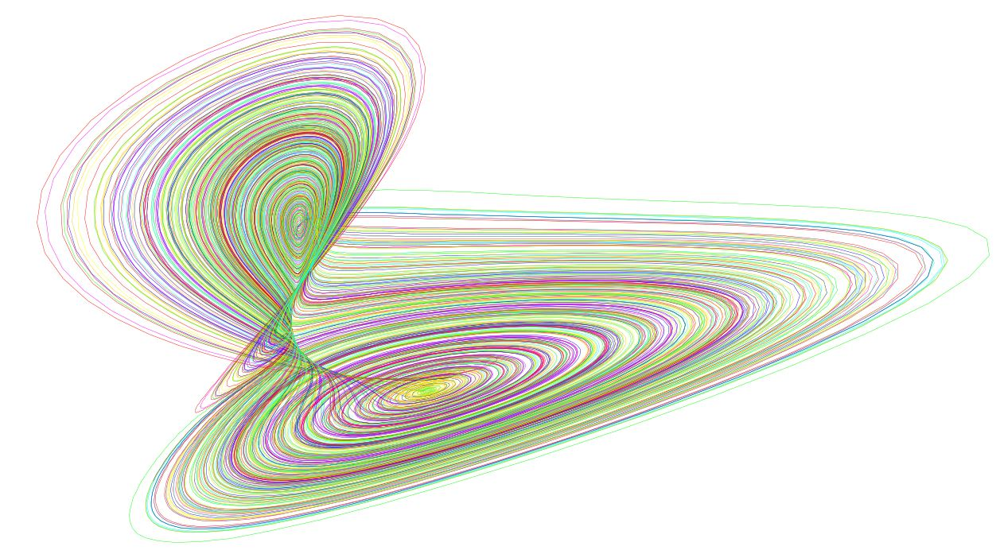

# Аттрактор Лоренца

Аттрактор Лоренца (от англ. to attract — притягивать) ― странный аттрактор, впервые найденный Лоренцем в нелинейной
системе обыкновенных дифференциальных уравнений  
  
При следующих значениях параметров: σ=10, r=28, b=8/3. Эта система вначале была введена как первое нетривиальное
галёркинкое приближение для задачи о конвекции морской воды в плоском слое, чем и мотивировался выбор значений σ, r и b.